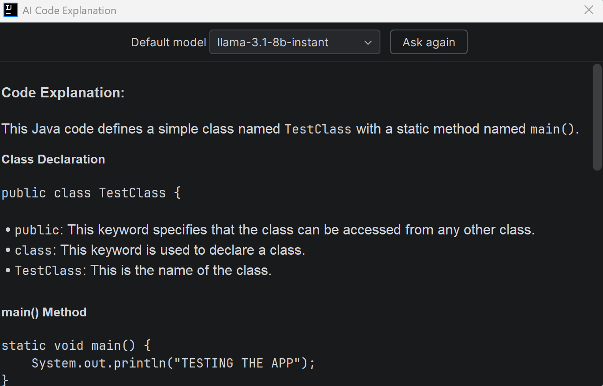
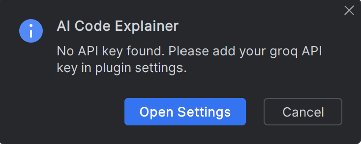
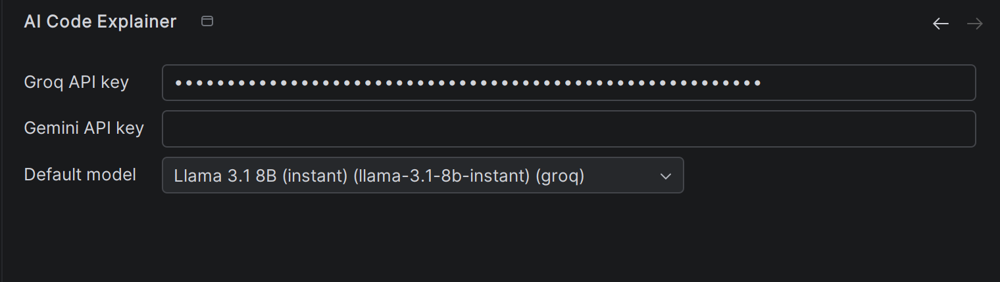

# AI Code Explainer – IntelliJ Plugin

AI Code Explainer is an IntelliJ-based plugin focused on AI-assisted code explanation directly inside the IDE. The plugin allows developers to select source code, trigger a shortcut, and receive AI-generated explanations without leaving their development environment.

---

# Features

* Explain selected code directly inside IntelliJ
* Configurable default AI model
* Support for multiple AI providers
* Secure API key storage using IntelliJ secure storage
* Extensible provider architecture for adding future AI providers
* Markdown-rendered explanation window inside the IDE

Currently supported providers:

* Groq
* Gemini

---

# How It Works

1. Select code inside the editor
2. Press `Ctrl + Alt + E`
3. The plugin sends the selected code to the configured default AI model
4. The explanation is rendered directly inside the IDE

If no API key exists for the selected provider, the plugin automatically redirects the user to the settings page to configure credentials.

---

# Screenshots


## Generated AI Explanation Window



---

## Missing API Key Detection



---

## Plugin Settings and Model Configuration



---

# Technologies Used

* Kotlin
* IntelliJ Platform SDK
* Swing UI Components
* Groq API
* Gemini API

---

# Setup

## Clone Repository

```bash
git clone https://github.com/Ljubomir-Ilievski/AI-Code-explainer-plugin
```

## Open Project

Open the project using IntelliJ IDEA.

## Run Plugin

Run the plugin using the Gradle IntelliJ run configuration:

```bash
./gradlew runIde
```

---

# Future Improvements

* Streaming responses
* Context-aware explanations using PSI
* Chat-based interactions
* Inline editor actions
* Conversation history
* Additional AI providers

---

# Learning Outcomes

This project helped me better understand:

* IntelliJ plugin architecture
* provider abstraction design
* secure credential handling
* AI integration inside development environments
